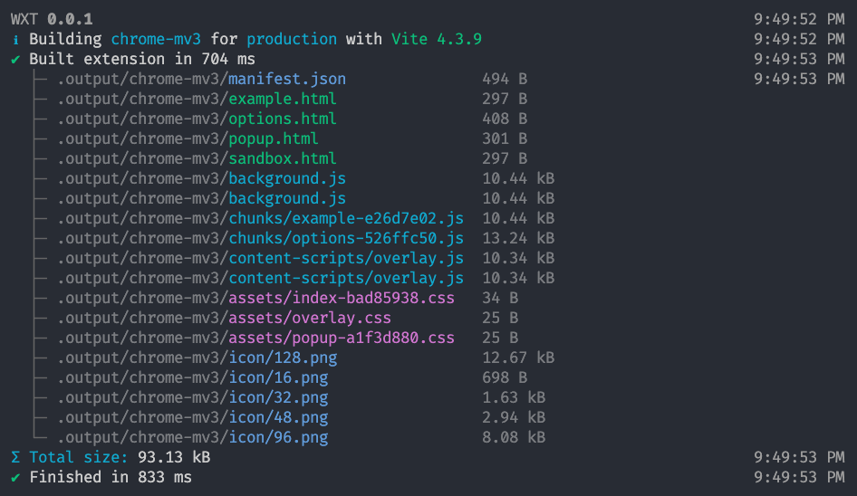

<h1 align="center">WXT</h1>

<i>Next gen framework for building web extensions. Powered by <a href="https://vitejs.dev/" target="_blank">Vite</a>.</i>

> **Warning**
>
> WXT is not ready for use yet. Production builds work, but dev mode is incomplete:
>
> - [x] HMR for HTML entrypoints
> - [ ] Open browser with extension installed
> - [ ] Rebuild and reload on certain file changes

## Features

- 🌐 Build for Chrome, Firefox, Edge, and Safari
- ✅ Supports both MV2 and MV3
- 📂 Directory based entrypoints
- 🚔 TypeScript
- 🦾 Auto-imports
- ⚡ Dev mode with HMR
- ⬇️ Download and bundle remote URL imports
- 🎨 Supports all major frontend frameworks (Vue, React, Svelte)

### Todo

- 🤖 Automated publishing
- 🖍️ Quickly bootstrap a new project
- 📏 Bundle analysis
- ⚡ Dev mode with HMR and **_auto-reload_**

## Get Started

Checkout the [installation guide](https://wxtjs.dev/get-started) to get started with WXT.
