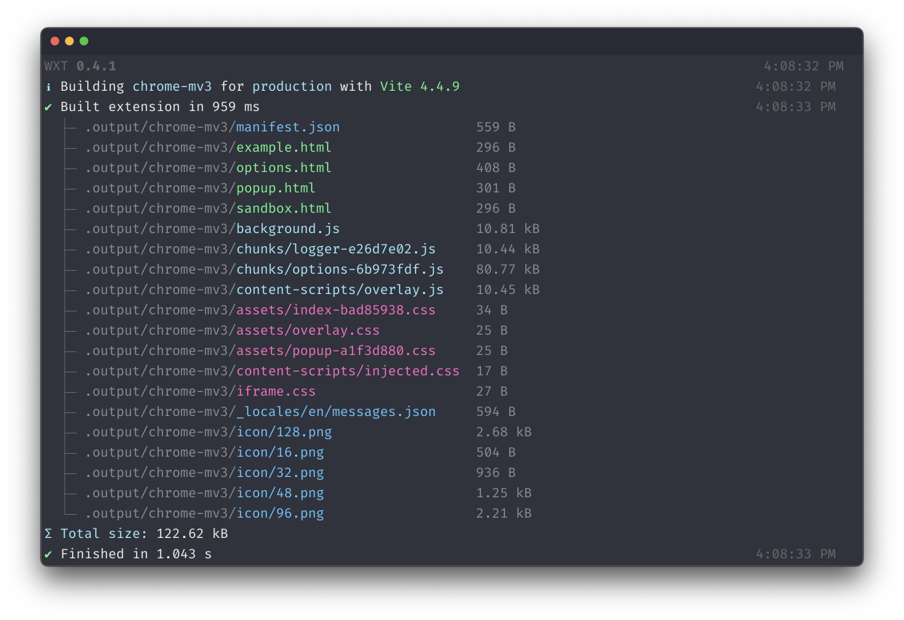

<h1 align="center"> WXT</h1>

<i>Next gen framework for developing web extensions. Powered by <a href="https://vitejs.dev/" target="_blank">Vite</a>. Inspired by <a href="https://nuxt.com/" target="_blank">Nuxt</a>.</i>

## Features

- 🌐 Supports all browsers
- ✅ Supports both MV2 and MV3
- ⚡ Dev mode with HMR & fast reload
- 📂 File based entrypoints
- 🚔 TypeScript
- 🦾 Auto-imports
- ⬇️ Download and bundle remote URL imports
- 🎨 Frontend framework agnostic: works with Vue, React, Svelte, etc

### Todo

- 🖍️ Quickly bootstrap a new project
- 📏 Bundle analysis
- 🤖 Automated publishing

## Get Started

Checkout the [installation guide](https://wxt.dev/get-started/installation.html) to get started with WXT.

## Contributors

