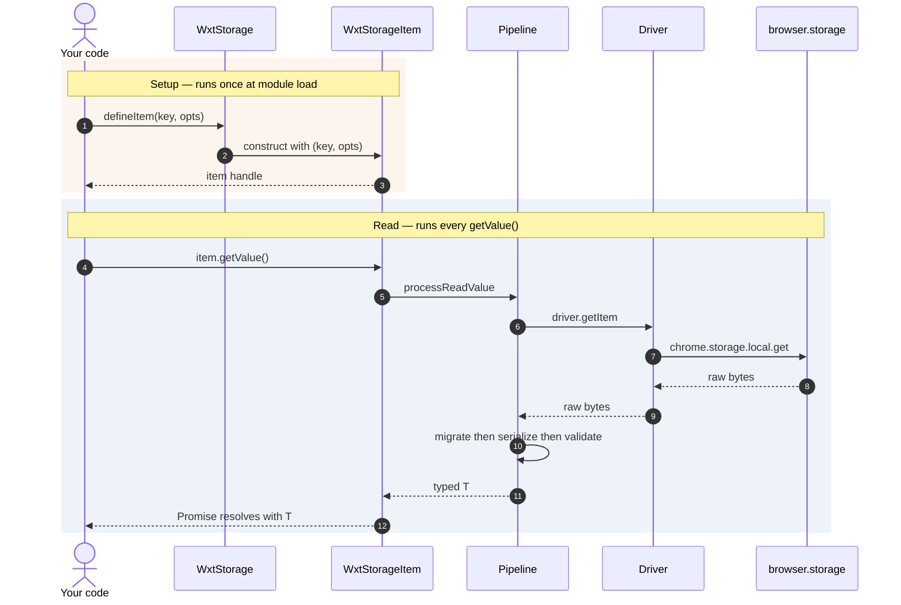
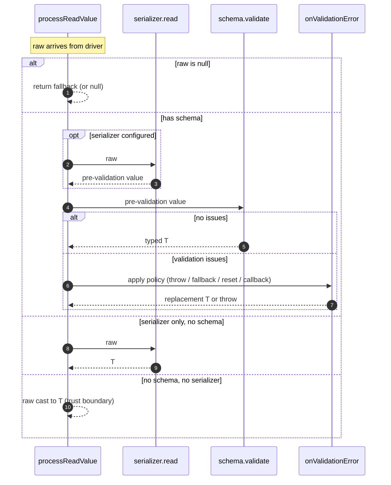
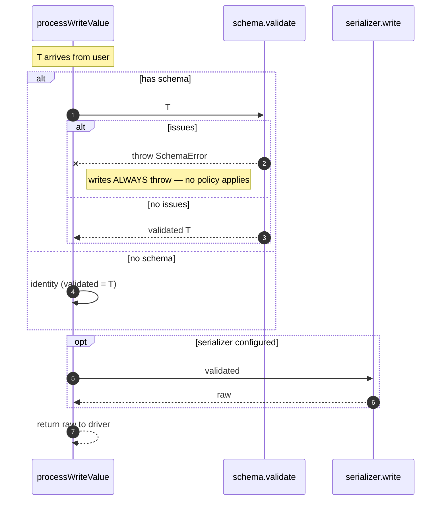
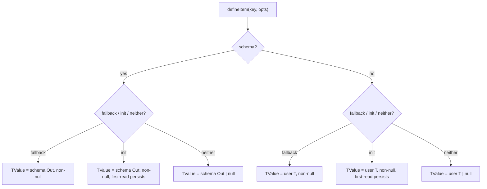
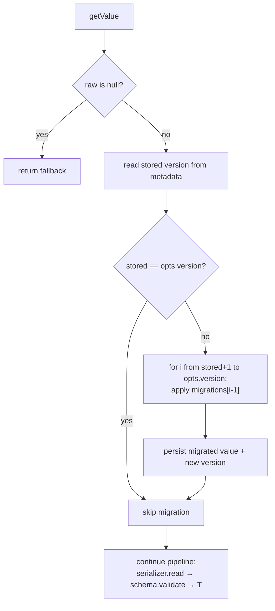
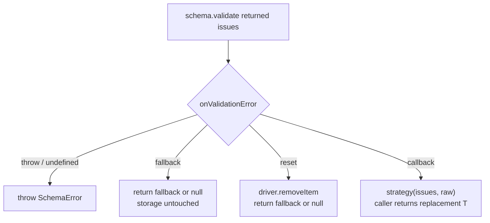
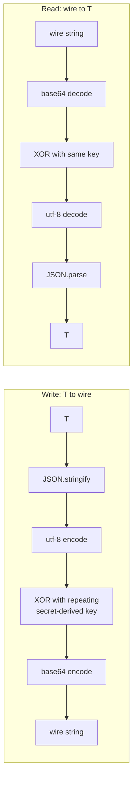
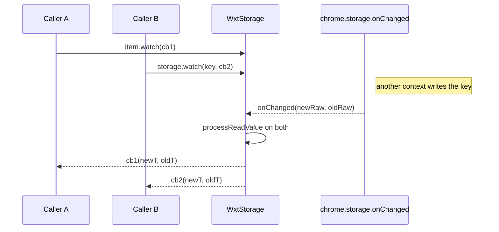

# `@wxt-dev/storage` — Code Tour

An architectural walkthrough of the storage package after the v2.0.0
schema PR + follow-ups (metadata schema, at-rest encoder). Diagrams use
Mermaid; render on GitHub, VS Code, or `mmdc`.

The goal here is _earn-your-place_ diagramming: a diagram exists only
where it shows structure, sequence, or a decision tree that prose or a
table couldn't. Everything else is a table.

---

## 1. What the package does in one paragraph

`@wxt-dev/storage` is a typed, schema-aware wrapper over
`chrome.storage.*`. It exposes four storage areas (`local | session |
sync | managed`) as one uniform interface, adds per-item schemas
(Standard Schema — Zod / Valibot / ArkType / Effect Schema), versioned
migrations, metadata, custom serializers, watchers, and bulk get/set.
You write `storage.defineItem('local:theme', { … })` and get a strongly-
typed item back; the package handles all the browser-API plumbing.

---

## 2. Architecture — one call, one diagram

Six participants across five layers. This is what happens when your code
defines an item at module load and then reads it later.



**Reading it**: time flows top-to-bottom, solid arrows are calls, dashed
arrows are returns. `autonumber` puts a step number on each message.
Messages 1–3 run once. Messages 4–11 run on every `getValue()` call.

### 2.1 Why there are two objects at Layer 2

`WxtStorage` and `WxtStorageItem` are **not two layers** and **not two
paths**. They are two objects at the same layer that play different
roles:

|                         | `WxtStorage` (singleton)                  | `WxtStorageItem` (handle)              |
| ----------------------- | ----------------------------------------- | -------------------------------------- |
| Role                    | Factory + escape hatch                    | Bound, schema-aware handle             |
| How you get one         | `createStorage()` (once, at package init) | `storage.defineItem()` (once per item) |
| Knows the schema?       | No                                        | Yes                                    |
| `T` in return types     | Caller-asserted, unverified               | Proven by the schema                   |
| Watcher callback typing | `WatchCallback<unknown>`                  | `WatchCallback<T>`                     |
| When you'd reach for it | Ad-hoc reads, bulk ops, legacy access     | Every place you defined an item for    |

The escape hatch (`storage.getItem<T>`) skips message 4 above and jumps
straight from user code into the pipeline with no schema. `T` becomes
an unverified caller assertion — the pre-v2.0.0 semantics preserved for
legacy code.

### 2.2 The narrow-waist principle

The driver interface is deliberately tiny: `getItem(key) → unknown`,
`setItem(key, value)`, `removeItem`, snapshot/restore, `onChanged`
registration. Everything _above_ the driver is validator-agnostic
pipeline code that never touches `chrome.*`. Everything _below_ the
driver is browser plumbing.

The payoff: swapping the driver (e.g. `fakeBrowser` in tests) doesn't
touch the pipeline; adding pipeline stages (schema, metadata schema,
encoder — all shipped since v2.0.0) doesn't touch the driver.

---

## 3. The type universe (table, not a diagram)

| Type                                      | Kind              | Purpose                                                                                                       |
| ----------------------------------------- | ----------------- | ------------------------------------------------------------------------------------------------------------- |
| `StorageArea`                             | Union             | `'local' \| 'session' \| 'sync' \| 'managed'`                                                                 |
| `StorageItemKey`                          | Template literal  | `` `${StorageArea}:${string}` ``                                                                              |
| `MetaKey<K>`                              | Template literal  | `` `${K}$` `` — sibling metadata key                                                                          |
| `StandardSchemaV1<In, Out>`               | External contract | The `~standard.validate` interface every schema exposes                                                       |
| `WxtStorageItemSerializer<TValue, TRaw>`  | Interface         | `{ read(TRaw): TValue, write(TValue): TRaw }`                                                                 |
| `OnValidationError<T>`                    | Union             | `'throw' \| 'fallback' \| 'reset' \| (issues, raw) => T`                                                      |
| `WxtStorageItemOptions<T, TRaw>`          | Interface         | Config bag: fallback / init / version / migrations / schema / serializer / onValidationError + metadata twins |
| `WxtStorage`                              | Interface         | Top-level singleton returned by `createStorage()`                                                             |
| `WxtStorageItem<TValue, TMetadata, TKey>` | Interface         | Handle returned by `defineItem()` — carries key, schema, fallback                                             |

Every user-facing type hangs off `WxtStorage` or `WxtStorageItem`.
`WxtStorageItemOptions` is symmetric: value-side fields (`schema`,
`serializer`, `onValidationError`) have metadata-side twins
(`metaSchema`, `metaSerializer`, `onMetaValidationError`) with matching
semantics.

---

## 4. The read pipeline

What happens inside message 8 of the §2 diagram, expanded.



**Trust-boundary shift**: pre-v2.0.0, `getItem<T>` always returned
`raw as T` — the caller's `T` was an unchecked assertion. With `schema`
present, the schema's `Out` type _is_ T and the pipeline returns
`result.value` without a cast. Types stop lying.

---

## 5. The write pipeline



**Why writes always throw on validation failure**: a write with invalid
input is a _programmer_ error (someone violated the schema contract in
code), while a read with invalid on-disk data is a _data_ error (schema
evolved, external write, corruption). They deserve different handling.
There is no silent-drop / fallback / reset that is safe for writes.

---

## 6. Read/write symmetry (table)

| Stage        | Read                         | Write                        |
| ------------ | ---------------------------- | ---------------------------- |
| Migrations   | runs first (versioning up)   | never runs on write          |
| serializer   | `.read` (raw → intermediate) | `.write` (validated T → raw) |
| schema       | validates the deserialized T | validates the input T        |
| Trust source | schema `Out` **is** T        | schema `Out` **is** T        |
| On failure   | `onValidationError` policy   | **always throw**             |

Schema owns the _type shape_; serializer owns the _wire representation_.
They compose like a phone system — schema is the call transcript,
serializer is the audio codec.

---

## 7. `defineItem` — the overload decision tree

Nine TypeScript overloads over one implementation. This is the shape:



`init` variants additionally split by sync vs `Promise<T>` return, and
`TMetadata` split doubles the count again — nine total signatures over
one implementation body.

**Why nine overloads, not one conditional type**: overloads give
`IntelliSense` a discrete return type per call shape (with vs without
`fallback`, `init`, `schema`). A mega-conditional would compile but
produce mystery blobs in tooltips and unreadable error messages.

**`fallback` vs `init` matters**: `fallback` _returns_ on empty read;
`init` _writes_ on first empty read (persists the default). Nullability
differs. Overloads keep that difference visible at the call site.

---

## 8. The `<const K extends StorageItemKey>` trick

```ts
// Without `const` on the type parameter — K widens:
getItem<T, K extends StorageItemKey>(key: K, ...)
// storage.getItem('local:theme') →  K = string
// item.key: string                    ← useless for typos or narrowing

// With `const` — K stays literal:
getItem<T, const K extends StorageItemKey>(key: K, ...)
// storage.getItem('local:theme') →  K = 'local:theme'
// item.key: 'local:theme'             ← flows into watch/getItems return types
```

Every key-accepting method (`getItem`, `setItem`, `defineItem`,
`removeItem`, `watch`, `getMeta`, `setMeta`, `removeMeta`) uses
`<const K>`. When the caller passes a string literal, K narrows to that
literal; if they widen explicitly (e.g. `getItem<T, StorageItemKey>(...)`),
K falls back to the union. Graceful degradation.

---

## 9. Migrations — versioned upgrades on read



**Migrations run BEFORE validation.** A stored v1 blob may not satisfy
the current schema — the point of a migration is to make it satisfy
the schema. Validating first would reject the very inputs migration
exists to accept.

**`migrations` is a positional tuple** indexed by target version:
`migrations[0]` = v1→v2, `migrations[1]` = v2→v3, etc.
`defineMigrations<TValue>()` is a builder helper that type-checks the
chain (each fn's output type = next fn's input type; last fn's output
= TValue).

---

## 10. `onValidationError` — reads only



| Mode         | When                                          | Risk                                       |
| ------------ | --------------------------------------------- | ------------------------------------------ |
| `'throw'`    | Development or when invalid data is a bug     | Crashes the caller                         |
| `'fallback'` | Preferences where "unknown → default" is fine | Broken data stays on disk until next write |
| `'reset'`    | Session caches you can rebuild                | **Data-destructive**                       |
| Callback     | Custom recovery (log, salvage, transform)     | You own the semantics                      |

Writes have no policy — see §5.

---

## 11. Metadata — same shape, no migrations (table)

| Aspect                 | Value pipeline                              | Metadata pipeline                                             |
| ---------------------- | ------------------------------------------- | ------------------------------------------------------------- |
| Storage key            | `theme`                                     | `theme$` (sibling)                                            |
| Pipeline order (read)  | migrate → serializer.read → schema.validate | serializer.read → schema.validate                             |
| Pipeline order (write) | schema.validate → serializer.write          | merge-then-validate → serializer.write                        |
| Options fields         | `schema`, `serializer`, `onValidationError` | `metaSchema`, `metaSerializer`, `onMetaValidationError`       |
| Migrations             | supported                                   | not supported (meta is library/app state, not versioned data) |
| Wholesale removal      | `removeItem`                                | `removeMeta()` bypasses validation                            |
| Partial removal        | n/a                                         | `removeMeta(['prop'])` validates the remainder                |
| Bulk ops               | `getItems` / `setItems` bypass schema       | `getMetas` / `setMetas` bypass schema                         |

**`setMeta` merges-then-validates.** Partial input is merged with the
current stored meta _before_ validation, so the schema always sees the
full post-write shape. This preserves the "writes throw on invalid"
invariant even with partial updates.

---

## 12. Encoder — obfuscation, not encryption

Bidirectional codec that composes with `schema`. The one diagram in
this doc that shows a concrete transformation pipeline:



**What it is**: two-way XOR-and-base64 serializer keyed by a caller-
supplied secret. Composes with `schema` — user code sees validated
values, on-disk sees encoded bytes.

**What it isn't**: encryption. The extension bundle ships the secret
in plaintext; anyone with the packaged `.crx` / `.xpi` can extract it
and decode every stored value.

**Reach for it to**: discourage casual DevTools inspection, break
naïve string-search greps on storage dumps. For real security use
`chrome.storage.session` (in-memory, wiped on browser restart) or an
authenticated remote store.

---

## 13. Watchers — fan-out



**Watchers pipe through `processReadValue`** before firing callbacks.
Your watcher sees validated `T`, not the raw wire form. If the schema
evolved and the on-disk value now fails validation, the watcher fires
with `null` (or throws, per `onValidationError`), not with a partially-
parsed object.

---

## 14. Bulk operations — the escape-hatch caveat

`getItems` / `setItems` / `getMetas` / `setMetas` accept a
**heterogeneous input array**: each element is either a bare
`StorageItemKey` (untyped, no options) or a `WxtStorageItem` handle
(schema-typed). The return type `GetItemsResult<T>` is a mapped type
that narrows each result slot based on its input shape.

**Bulk ops do NOT apply the schema at runtime.** Even when you pass an
item handle, the bulk path bypasses `processReadValue` /
`processWriteValue`. This matches the pre-v2.0.0 semantics as an
escape hatch — documented caveat.

If you need schema enforcement, iterate over individual items.

---

## 15. Failure modes

| Path                    | Failure                 | Behavior                        |
| ----------------------- | ----------------------- | ------------------------------- |
| Read                    | schema issues           | apply `onValidationError` (§10) |
| Read                    | serializer.read throws  | propagates to caller            |
| Read                    | migration throws        | propagates to caller            |
| Read                    | driver / browser error  | propagates to caller            |
| Write                   | schema issues           | **always throw** SchemaError    |
| Write                   | serializer.write throws | propagates                      |
| Write                   | driver quota exceeded   | propagates                      |
| Meta read               | metaSchema issues       | apply `onMetaValidationError`   |
| Meta write / removeMeta | metaSchema issues       | **always throw**                |
| Meta                    | metaSerializer throws   | propagates                      |

Two invariants: **writes never silently drop data** (every failure
throws), **reads have an explicit recovery policy** (never guesses).

---

## 16. Testing — how the package proves itself

**Runtime tests** cover the pipeline against `fakeBrowser`: schema
paths × `onValidationError` modes, serializer round-trips, migration
chains, watcher fan-out, bulk / snapshot / restore, metadata merge /
remove edge cases, encoder round-trip and failure modes.

**Type tests** run through `tsc` because `vitest.config.ts` sets
`typecheck: { enabled: true, include: ['**/*.test.ts'] }`. That makes
`expectTypeOf` assertions a real gate — a type regression fails the
suite the same way a runtime regression does. Coverage includes each
`defineItem` overload, literal-key preservation via `<const K>`,
`TValue`/`TMetadata` inference, non-null return types when `fallback`/
`init` are present, and the widening test for explicit generic
arguments.

Counts as of the current work: base 316 tests, meta PR adds 26 (342),
encoder PR adds 22 (338 on its branch).

**Parametrization principle** (from cross-review feedback): parameterize
over _inputs that change the outcome_, not over lookup strings. Don't
merge distinct behaviors under one parametrized block. Coverage delta
per test is the metric.

---

## 17. What the schema PR broke (v2.0.0 breaking changes)

| #   | Change                        | Before                             | After                                      |
| --- | ----------------------------- | ---------------------------------- | ------------------------------------------ |
| B1  | `getItem<T>` default          | `T = any`                          | `T = unknown`                              |
| B2  | `WxtStorageItem` generics     | `<TValue>`                         | `<TValue, TMetadata = {}, TKey>`           |
| B3  | `migrations` shape            | `Record<number, (any) => any>`     | `ReadonlyArray<(any) => unknown>`          |
| B4  | `WatchCallback` signature     | `(new: T \| null, old: T \| null)` | `(new: T, old: T)` — T carries nullability |
| B5  | `getItems` / `getMetas` input | `StorageItemKey[]`                 | `GetItemsInputElement[]` (union)           |
| B6  | `KeyParts<K>` utility         | exported                           | removed (JSDoc-drifted)                    |
| B7  | `StorageItemKey<G>` generic   | had unused generic                 | generic removed (dead parameter)           |

Each break tightens type safety by removing an _unverified_ caller-side
assertion.

---

## 18. Suggested reading order

New to the package:

1. `docs/storage.md` — user-facing API narrative (top-down)
2. This document — architecture (side-view)
3. `packages/storage/src/types.ts` — the type universe in code
4. `packages/storage/src/index.ts` §§ `processReadValue`,
   `processWriteValue` — the pipeline core (lines 162–260)
5. `packages/storage/src/__tests__/index.test.ts` — behavior-by-example

Extending the package:

1. §§ 4–6 of this document (types + pipelines)
2. `advisor-plans/storage-meta-schema-rfc.md` — reference design for
   adding a new pipeline branch
3. `advisor-plans/branch-audit-9e69b39b.md` — working list of
   deepening opportunities

---

## 19. Non-obvious details worth internalizing

- **`~standard` is not private.** Standard Schema surfaces
  `~standard.validate` as a public interface member. The tilde is
  historical.
- **`schema.validate` may return a Promise.** All read/write paths
  `await` it. Zod async, Effect Schema decoders work out of the box.
- **`defineSchema<T>(parseFn)`** wraps a non-Standard-Schema validator
  (TypeBox, io-ts, hand-rolled) in a synthetic `~standard.validate`.
- **`onValidationError: 'reset'` is data-destructive** and disabled on
  the watch path (via `pipelineOpts.allowReset`). A watcher observing
  invalid data must not wipe it — that would race with concurrent
  writers.
- **Metadata reads on a nonexistent key return `{}`**, not `null`.
  `getMetaValue` normalizes null/undefined/non-object to `{}` at the
  boundary. That's why `getMeta()` returns `NullablePartial<TMetadata>`.
- **The driver's `getItem` returns `unknown`** — every driver output
  passes through the pipeline before hitting user types. There is no
  `driver.getItem<T>` shortcut.

---

## Colophon

State as of the v2.0.0 schema PR + follow-ups (metadata schema →
v2.1.0 candidate; encoder → v2.1.0 candidate). If a diagram diverges
from code, the code is right — file an issue and fix the diagram.

Eight diagrams, each carrying content that would be worse as prose:
sequence (§2, §4, §5, §13), decision tree (§7, §10), flow (§9, §12).
Everything else is a table.
