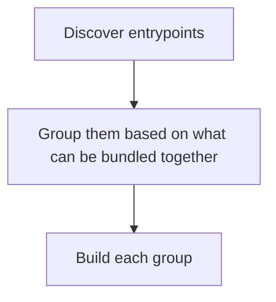
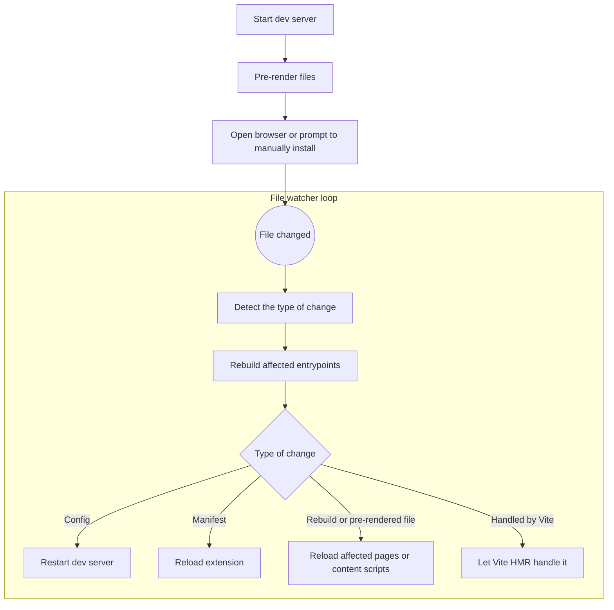

# How WXT Works

WXT is two things:

1. An extendable build tool
2. A set of runtime utils

The combination of these two makes WXT a "framework". It's really important to the WXT team that developers can use either one of these two parts of WXT independently. You can use all your own runtime utils and packages, but use WXT for building, or just use the runtime utils WXT provides with another build tool. You should be free to use them however you want.

That said, the runtime utils are all simple, isolated packages. They won't be described here. Instead, let's focus on the build tool.

## Vite: Inside or outside?

WXT uses Vite under the hood for bundling JS and as the dev server. However, when projects are based on Vite, you have two options:

- Build a plugin and work "inside" Vite's lifecycle, hooking into and reacting to different processes.
- Build a CLI "outside" Vite, and use its JS APIs to schedule builds or start the dev server whenever the project needs.

If you've used WXT, you probably know that it has its own CLI, `wxt`, and that projects don't use a `vite.config.ts` file, they use a `wxt.config.ts` file. So WXT works "outside" the Vite lifecycle. But why?

When Aaron created WXT, it was not his first foray into the extension build-tool world. He previously created `vite-plugin-web-extension`, which was a Vite plugin that worked inside Vite's lifecycle. There were two problems with this approach:

1. Plugins can only react to and run code at specific times in the build process
2. Pre-Environment API, there was no concept of multiple, independent bundles from a single `vite build`

Extensions are unique in that they're a combination of several different, independent `vite build`s. Inside a plugin, you had to schedule multiple, separate `vite build`s and somehow integrate them with the original. For dev mode, you also had to "pre-render" some files and that leads to hacks and work-arounds when working inside Vite's lifecycle.

There were other reasons Aaron chose to build WXT outside of Vite:

1. Abstract the builder and leave the door open for support for alternatives to Vite
2. Build its own extensible hooks system to allow projects more control over its build system

In fact, these design choices are very similar to the decisions the Nuxt team made, and WXT is heavily inspired by Nuxt and uses a lot of the same tooling as Nuxt internally.

## The Build Process

> [`internal-build.ts`](https://github.com/wxt-dev/wxt/blob/0d9c34b59e3f21840c471dec3fd4d9b0cb3b013a/packages/wxt/src/internal/internal-build.ts)

At a high level, WXT's build process is very simple:



Let's go through each of these steps more in-depth:

### Entrypoint Discovery

> [`find-entrypoints.ts`](https://github.com/wxt-dev/wxt/blob/0d9c34b59e3f21840c471dec3fd4d9b0cb3b013a/packages/wxt/src/internal/find-entrypoints.ts)

Entrypoints are discovered by reading the file system and looking at the files in the `wxt.config.entrypointsDir` directory that match specific filename patterns.

Because WXT decided to store config for each entrypoint in the entrypoint itself, rather than in a single location like a manifest file, WXT also needs to import or read the file to extract that info. This is... problematic. For HTML files, it's simple. Just import it, parse the DOM with `linkedom`, then find the `<meta>` elements. CSS files don't have config (as of October 3, 2026, v0.21.4). It's JS entrypoints that are the problem.

JS entrypoints, like the background or content scripts, are meant to be run in the browser. But to extract their config, we need to import the file into a Node.js environment. That means globals, like `window` and `browser`/`chrome` are not present. So WXT does two things to import the config:

1. Polyfills common globals, like `window`, `document`, and `browser`, with the [extension environment utils](https://github.com/wxt-dev/wxt/blob/0d9c34b59e3f21840c471dec3fd4d9b0cb3b013a/packages/wxt/src/internal/environments/extension-environment.ts).
2. Parses the file, removes the `main` function with the [`removeEntrypointMainFunction`](https://github.com/wxt-dev/wxt/blob/0d9c34b59e3f21840c471dec3fd4d9b0cb3b013a/packages/wxt/src/internal/builders/vite/plugins/remove-entrypoint-main-function.ts) Vite plugin, and tree-shakes any imports that are no longer necessary.

This process allows us to quickly import a minimal version of the entrypoint that contains just a default export of the config.

Once we've read the config from the entrypoint file, the entrypoints get saved as an [`Entrypoint[]`](/api/reference/wxt/type-aliases/Entrypoint) and passed to the next stage of the build process.

### Entrypoint Grouping

> [`group-entrypoints.ts`](https://github.com/wxt-dev/wxt/blob/0d9c34b59e3f21840c471dec3fd4d9b0cb3b013a/packages/wxt/src/internal/group-entrypoints.ts)

When building extensions, some files can be bundled together with code splitting, some must be bundled independently. WXT calls the process of determining what entrypoints can be bundled together "grouping".

What can be bundled together? There are really three types of groups:

1. ESM: ESM background and non-sandboxed HTML pages (popup, options, unlisted)
2. Sandboxed ESM: Sandboxed HTML pages
3. Individual entrypoints: Non-ESM background, content scripts, unlisted scripts, and CSS entrypoints

The mapping from entrypoint type to group looks like this:

<<< @/../packages/wxt/src/internal/group-entrypoints.ts#snippet

Once grouped, we return the result as an [`EntrypointGroup[]`](/api/reference/wxt/type-aliases/EntrypointGroup), which is the same as `Array<Entrypoint | Entrypoint[]>`.

### Building

> [`rebuild.ts`](https://github.com/wxt-dev/wxt/blob/0d9c34b59e3f21840c471dec3fd4d9b0cb3b013a/packages/wxt/src/internal/rebuild.ts), [`build-entrypoints.ts`](https://github.com/wxt-dev/wxt/blob/0d9c34b59e3f21840c471dec3fd4d9b0cb3b013a/packages/wxt/src/internal/build-entrypoints.ts), [`vite/index.ts`](https://github.com/wxt-dev/wxt/blob/0d9c34b59e3f21840c471dec3fd4d9b0cb3b013a/packages/wxt/src/internal/builders/vite/index.ts)

Before actually running the Vite builds, we first generate the `.wxt` directory. More on this later, but for now, this directory contains generated code that needs to exist and be up-to-date before the builds will succeed.

Now WXT can run a build for each entrypoint group:

- Individual groups, which contain a single entrypoint, are built with [Library Mode](https://vite.dev/guide/build#library-mode), which supports the IIFE output format. IIFEs provide good isolation and support for script return values, making it ideal for content scripts and unlisted scripts.
- ESM groups, even if they only contain one entrypoint, are built as a [Multi-page App](https://vite.dev/guide/build#multi-page-app), which supports code-splitting between HTML and JS entrypoints.

The builder chooses between them based on the shape of the group:

<<< @/../packages/wxt/src/internal/builders/vite/index.ts#snippet

By default, Vite's outputs don't work for extensions. WXT applies a lot of plugins to each build; anything from adding return values for lib mode scripts, polyfilling `import.meta.url`, resolving "virtual" modules, or slightly tweaking the output JS.

WXT builds all the entrypoint groups in series. Vite builds are very memory-intensive, and running multiple in parallel can quickly hit Node's memory limit.

> One planned improvement here is to move from doing separate Vite builds for each group to using the [Environment API](https://vite.dev/guide/api-environment). See [#2525](https://github.com/wxt-dev/wxt/issues/2525) for tracking progress.
>
> The main benefit here is a single Vite build is responsible for building all the different entrypoint groups, and it doesn't have to re-transform or re-process the same files multiple times, theoretically speeding up builds and using less memory.

After the builds are done, WXT summarizes and outputs all the files that were generated and their size.

## Dev Mode

Dev mode is more complex than building.



When detecting the type of change, WXT determines whether the extension needs to be reloaded, which entrypoint groups need to be rebuilt, and whether Vite's HMR can handle the change.

### Pre-render Files

Vite normally serves all content from its dev server in dev mode. The browser loads everything from `http://localhost:5173`, and nothing is written to the `dist` directory.

That's not the case for extensions - you need to create a directory with a `manifest.json` and all entrypoints. So WXT needs to do some "pre-rendering", where it generates a minimal version of all entrypoints.

For some entrypoints, like HTML pages, that's just the HTML page. Any URLs in the HTML file are pointed at the dev server on `localhost` by the [`devHtmlPrerender`](https://github.com/wxt-dev/wxt/blob/0d9c34b59e3f21840c471dec3fd4d9b0cb3b013a/packages/wxt/src/internal/builders/vite/plugins/dev-html-prerender.ts) Vite plugin. For others, like content scripts or the background script, there is no minimal version of the file and WXT performs a full build.

This means WXT manages a mix of full builds that are rebuilt completely when a file changes, pre-rendered HTML files that need to be reloaded when the HTML file changes, and Vite's HMR that handles changes to "assets" of the pre-rendered HTML files.

### Dev Server Communication

During dev mode, WXT injects additional code into the extension's background script to setup a websocket connection with the dev server. If the extension doesn't have a background script, WXT adds one in dev mode.

The websocket connection is used to perform various types of reloads after a file is saved:

- When the server tells the extension to reload due to a manifest change, the background script runs `browser.runtime.reload()`.
- When an HTML file is changed, the background finds any tabs with that HTML page open, and reloads the tab using `browser.tabs.reload()`.
- When a content script is added, changed, or removed, the background uses the `browser.scripting` APIs to register and update the content scripts without having to reload the entire extension.

There is a lot of code in WXT dedicated to determining what type of reload is necessary when a file is changed. See [`detect-dev-changes.ts`](https://github.com/wxt-dev/wxt/blob/0d9c34b59e3f21840c471dec3fd4d9b0cb3b013a/packages/wxt/src/internal/detect-dev-changes.ts) for the actual implementation, and [`create-server.ts`](https://github.com/wxt-dev/wxt/blob/0d9c34b59e3f21840c471dec3fd4d9b0cb3b013a/packages/wxt/src/create-server.ts) for how the changes are communicated to the background script.

## `.wxt` Directory

> [`generate-wxt-dir.ts`](https://github.com/wxt-dev/wxt/blob/0d9c34b59e3f21840c471dec3fd4d9b0cb3b013a/packages/wxt/src/internal/generate-wxt-dir.ts)

One of the most powerful features of WXT is its extendable build system. Alongside [hooks](/guide/essentials/config/hooks), WXT relies heavily on code generation. Anything from the project's base `tsconfig.json`, dedicated types for each project, or runtime code can be generated inside the `.wxt` directory.

The core WXT package generates some per-project config and types. Third-party NPM packages can generate runtime utils and their own types. Projects can perform module augmentation to change or add to types from NPM packages. They can change how fundamental parts of WXT's build process work, like entrypoint discovery.

### TypeScript Project

One of the things WXT generates here is the `.wxt/tsconfig.json` file. WXT projects extend this file in their own `tsconfig.json`:

```jsonc
{
  "extends": "./.wxt/tsconfig.json",
}
```

Generating a tsconfig does a few useful things:

1. Prevents projects from being out-of-date with WXT's necessary compiler options
2. Provides a standard way for generated declaration files to be included in the project's type checking

By default, TS excludes hidden directories (ones that start with a `.`) from being included in the TS project, so `tsc` won't check them for errors, nor include declaration files that may augment modules or add globals. Because `.wxt` is a hidden directory, the generated `tsconfig.json` file also manually includes one file, `.wxt/wxt.d.ts`, in the TS project:

```jsonc
// .wxt/tsconfig.json
{
  "include": ["../**/*", "./wxt.d.ts"],
}
```

This file, `.wxt/wxt.d.ts`, is used to include all the global declaration files (that are not modules that can be imported) using [triple-slash references](https://www.typescriptlang.org/docs/handbook/triple-slash-directives.html) into the TS project. Without manually including the `wxt.d.ts` file, other files like `.wxt/types/paths.d.ts` would be ignored by TS, and projects would lose access to the types for `browser.runtime.getURL`.

Projects can add to the `wxt.d.ts` via the [`prepare:types` hook](/api/reference/wxt/interfaces/WxtHooks.html#prepare-types).

But that only applies to global declarations that are never imported. If a module generates a regular TS file, and the project imports that file, all imported files are added to the TS project without needing to be included in the `.wxt/tsconfig.json`.

## Virtual Modules

Virtual modules are fundamental to both WXT's build process and dev mode. There are two types of virtual modules:

- Aliases to fully generated JS modules that are not written to the disk.
- Aliases to project files whose location varies between projects.

In [`wxt/src/virtual/*`](https://github.com/wxt-dev/wxt/tree/0d9c34b59e3f21840c471dec3fd4d9b0cb3b013a/packages/wxt/src/virtual), there are some templates for the virtual modules used as the input for different entrypoints. Because these files are meant to be used in projects using WXT, not in WXT itself, they're a separate TS project in the source code. When the package is built for NPM, they are transpiled down to JS and loaded by file path, not by importing them, in Vite plugins.

Other virtual modules, like `virtual:user-background-entrypoint`, resolve to a project file whose location may vary. In this case, it would resolve to `entrypoints/background.ts` or `entrypoints/background/index.ts`, whichever exists.

All virtual modules are "resolved" in Vite plugins - whenever a virtual module is imported, the plugin either returns a string of JS code or points Vite to a file on disk.

## Public APIs vs CLI

> [src/index.ts](https://github.com/wxt-dev/wxt/blob/0d9c34b59e3f21840c471dec3fd4d9b0cb3b013a/packages/wxt/src/index.ts), [commands.ts](https://github.com/wxt-dev/wxt/blob/0d9c34b59e3f21840c471dec3fd4d9b0cb3b013a/packages/wxt/src/cli/commands.ts)

WXT provides a set of public APIs. Anything from small helper utils to the full `build` function. Helper utils are simple, pure functions. This section will focus on the "higher-level" public APIs the CLI uses.

The CLI is built on top of the high-level public APIs:

- `wxt` &rarr; `import { createServer } from 'wxt'`
- `wxt build` &rarr; `import { build } from 'wxt'`
- `wxt prepare` &rarr; `import { prepare } from 'wxt'`
- `wxt clean` &rarr; `import { clean } from 'wxt'`
- `wxt zip` &rarr; `import { zip } from 'wxt'`
- Etc.

Each command just builds some config based on flags, then calls the appropriate public API:

<<< @/../packages/wxt/src/cli/commands.ts#prepare

These "higher-level" public APIs all have one thing in common: the first thing they do is register the global `wxt` object.

<<< @/../packages/wxt/src/prepare.ts#snippet

### The `wxt` Object

Throughout WXT's source code, you'll see references to this `wxt` object. It is defined in [`internal/wxt.ts`](https://github.com/wxt-dev/wxt/blob/0d9c34b59e3f21840c471dec3fd4d9b0cb3b013a/packages/wxt/src/internal/wxt.ts). Generally, reassigning exported globals like this is a bad practice: it's not always clear when these variables are initialized.

However for WXT, given how deeply nested some functions and code paths are, and the fact that they all need to access certain global values, using a global value saves a lot of function arguments and makes the code much more easier to follow. Additionally, it provides convenient context to hooks and WXT modules.

However, that means it's very important to understand when the variable is initialized and where it can be used in the code base. Thankfully, the rules are very clear:

- As mentioned, it's initialized when any of the higher-level public APIs are called

  <<< @/../packages/wxt/src/prepare.ts#snippet

- It can be used anywhere in the [`src/internal`](https://github.com/wxt-dev/wxt/tree/0d9c34b59e3f21840c471dec3fd4d9b0cb3b013a/packages/wxt/src/internal) directory

  <<<@/../packages/wxt/src/internal/generate-wxt-dir.ts#snippet
